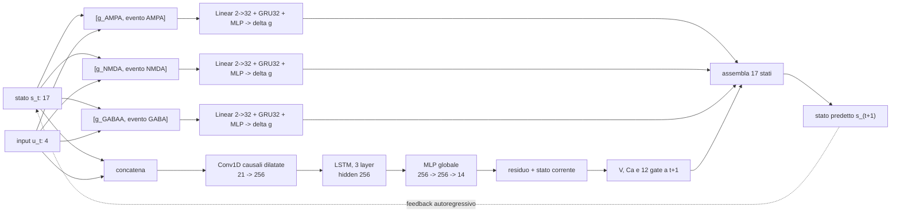

# Evoluzione dell'architettura e stato corrente

## Punto di partenza: ConvLSTM XL

Nel progetto il nome ConvLSTM indica una pipeline `Conv1D causali + LSTM`, non
la cella ConvLSTM bidimensionale usata per immagini o video.

La configurazione XL era:

```text
input_t = [17 stati normalizzati, 4 input normalizzati]       21 feature
  -> CausalConv1D 21 -> 320, kernel 5, dilation 1
  -> LayerNorm + SiLU
  -> CausalConv1D 320 -> 320, kernel 5, dilation 2 + residual
  -> LayerNorm + SiLU
  -> CausalConv1D 320 -> 320, kernel 3, dilation 4 + residual
  -> LayerNorm + SiLU
  -> LSTM width 320, 3 layer
  -> Linear 320 -> 320 -> 17
  -> delta residuale aggiunto allo stato corrente
  -> 17 stati al tempo successivo
```

Le tre convoluzioni vedono 21 campioni causali, cioe 2.1 ms con `dt=0.1 ms`.
La LSTM trasporta poi una memoria non limitata a quella finestra. XL aveva
3,429,137 parametri, sequenze di training da 128 passi e 50 epoche.

L'uscita non e soltanto il voltaggio: e l'intero stato Markoviano normalizzato
al passo successivo. Nel rollout, i 17 stati predetti vengono reinseriti; i
quattro input esterni restano assegnati dal protocollo.

## Passaggi sperimentali

### 1. Scaling della ConvLSTM

Base, Large e XL mostrarono un miglioramento monotono one-step con la capacita:
circa 0.0418, 0.0311 e 0.0264 mV di voltage RMSE. Questo sostiene che la
transizione contiene struttura temporale locale multiscala e memoria ricorrente
che una MLP, una GRU o una LSTM semplice sfruttavano peggio.

Il rollout lungo mostro pero traiettorie catastrofiche e spike spurii. Quindi
una stima molto accurata di `F(x_t,u_t)` sui dati teacher non garantisce che la
funzione appresa sia stabile quando viene iterata fuori dalla manifold teacher.

### 2. Mosaico ontologico di sole GRU

La fattorizzazione completa in sottosistemi locali perse informazione condivisa
e peggioro il one-step, ma miglioro alcuni rollout e alcune famiglie di stato.
Conclusione: esiste struttura locale, ma il sistema non e totalmente
fattorizzabile; serve conservare un backbone globale.

### 3. Composito accettato: ConvLSTM Large + GRU recettoriali

Il backbone Large rimane intatto per tensione, calcio e 12 gate. Soltanto le
tre conduttanze sinaptiche vengono affidate a tre GRU standard indipendenti.
Un controllo monolitico con quasi lo stesso numero di parametri non ottenne il
medesimo guadagno. Le tre transizioni recettoriali sono quindi localmente
chiuse e dinamicamente separabili rispetto alla loro evoluzione di stato.

Il composito ha 2,224,433 parametri: circa il 35% in meno della vecchia XL. Nel
confronto controllato miglioro gli errori recettoriali di circa 85-90%, il mean
normalized RMSE di circa 15% a dataset pieno e il rollout di tensione a 500 ms
da circa 18.10 a 3.84 mV. Questi numeri non vanno confrontati direttamente con
quelli dello scaling XL, perche dataset e run non erano identici.



### 4. Tentativo di separare la coordinata 8

Una GRU locale per la coordinata 8 miglioro la previsione one-step della
coordinata stessa, ma peggioro il sistema globale e il rollout. Una testa
ausiliaria globale ripristino e miglioro il one-step senza ripristinare la
stabilita. Sostituire la GRU con una MLP Markoviana elimino la memoria privata,
ma non il problema di rollout.

La causa non era quindi semplicemente la memoria nascosta della GRU. La
coordinata 8 e localmente comprimibile sui dati teacher, ma non costituisce un
sottosistema autonomo chiuso sotto iterazione. Va lasciata nel backbone globale.

## Architettura accettata oggi

```text
BACKBONE GLOBALE
  input completo (21)
  -> tre Conv1D causali, width 256, receptive field 21 campioni
  -> LSTM a 3 layer, width 256
  -> testa residuale per stati 0..13

TRE ESPERTI LOCALI
  [g_AMPA, evento AMPA] -> Linear -> GRU -> MLP -> delta g_AMPA
  [g_NMDA, evento NMDA] -> Linear -> GRU -> MLP -> delta g_NMDA
  [g_GABAA, evento GABA] -> Linear -> GRU -> MLP -> delta g_GABAA

ASSEMBLAGGIO
  14 output globali + 3 output locali = 17 stati successivi
```

Le varianti con GRU/MLP locale per la coordinata 8 sono ablation diagnostiche,
non fanno parte dell'architettura accettata.

## Passaggio al nuovo compartimento fedele

Il nuovo teacher ha 20 stati: 17 intrinseci originali Hay e 3 recettoriali.
I vecchi checkpoint non sono compatibili e non devono essere trasferiti come se
la funzione fosse invariata. Il nuovo notebook riparte quindi dalla ConvLSTM
Large come baseline generale. Dopo aver misurato one-step, rollout e variabili
lente su questo nuovo teacher, il primo confronto compositivo corretto sara:

```text
ConvLSTM Large a 20 uscite
contro
ConvLSTM Large globale a 17 uscite + tre GRU recettoriali
contro
controllo monolitico parameter-matched
```

Solo dopo questo controllo potremo dire se la separabilita recettoriale si
trasferisce dal ridotto al compartimento fedele.

