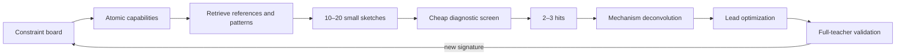

# Creative architecture discovery

Architecture invention is treated as an industrial creative process: constrained, plural, iterative and evidence-producing. The machine-readable protocol is [`creative_methodology.json`](../research/creative_methodology.json).

## Five search modes

| Mode | Starting knowledge | Architectural translation | Main danger |
|---|---|---|---|
| rational / structure-based | strong biological or mathematical prior | choose a standard bias compatible with the inferred structure | confusing physical plausibility with learnability |
| analogical / ligand-based | successful related architectures | extract shared functional descriptors | copying superficial form or staying near known solutions |
| phenotypic screening | mechanism poorly known | screen a structurally diverse curated library | stopping at leaderboard success |
| fragment-based | minimal primitives can be isolated | test, grow, link or merge components | isolated fragments may fail when composed |
| constrained de-novo | measured requirement has no adequate known template | generate new compositions from established primitives | untrainable or uninterpretable inventions |

The project can change mode as knowledge grows. It should usually begin with rational constraints plus phenotypic diversity, move to fragment tests and mechanism deconvolution, then become increasingly rational during lead optimization.

## Daily creative pipeline

### Constraint board

It records the causal information available at initialization and each step, prohibited teacher information, measured failure signatures, state/timescale/spatial structure, parameter/update ceiling and guardrails. Constraints play the role of a composer's brief: they make the creative space navigable.

### Atomic decomposition

“Approximate the neuron” is not a capability. The current candidate atoms include:

- retain slow causal evidence;
- respond to a rapid event conditional on state;
- reproduce narrow amplitude and phase without subthreshold spill;
- propagate local effects across four coupled compartments;
- maintain bounded own-state rollout;
- preserve very slow coordinates during fast transitions;
- represent stochastic/event uncertainty when the input contract is incomplete.

The list must evolve from observed failures. It is not a biological ontology disguised as independence.

### Sketch generation

Generate several structurally diverse candidates from different taxonomy families or search modes. Cosmetic width/depth changes do not count as different sketches. Each sketch states:

- the measured requirement it addresses;
- the established patterns it uses;
- its expected capability signature;
- what it should fail if the hypothesis is wrong;
- its information and compute contract.

### Screening and hit selection

Run cheap microtasks and mini-scaling surfaces. Select 2–3 hits by their whole capability profile, uncertainty and guardrails—not a single final value. Diversity among survivors is useful because it maximizes the chance of learning different mechanisms.

### Target deconvolution

The hit is not yet understood. Use layerwise probes, activation/gate trajectories, gradients, Jacobians, ablation, patching and counterfactual intervention. Determine whether the intended information is present, accessible and causally used.

### Lead optimization

Only now refine insertion point, normalization, activation, objective, recurrence depth or rate. Change one causal factor at a time. The goal is to strengthen a measured mechanism, not tune arbitrary knobs.

### Resonance and composition

Return to the actual Hay teacher under matched controls. A synthetic result that does not resonate becomes a bounded capability fact, not a full-system solution. Compose modules only after independent evidence shows complementary abilities; compare with a monolithic parameter-matched control.

## Orthogonal-information test

Before authorizing a run, answer:

1. Which live hypotheses predict different outcomes?
2. Which confound is fixed?
3. What information is new relative to existing experiments?
4. Which branch closes under either outcome?
5. What quantitative and qualitative signature would surprise us?

If the answers are vague, the experiment is iteration, not discovery.

