# Hypothesis graph

Node and edge truth is in [`hypothesis_graph.json`](../research/hypothesis_graph.json); this is the readable map.

```mermaid
flowchart TB
  O1[O-001 smooth regimes learned] --> HT{{H-TIME-01 mixed timescales open}}
  O2[O-002 amplitude collapse] --> HL2{{H-LOSS-02 imbalance supported diagnostically}}
  O3[O-003 high-frequency collapse] --> HO{{H-OPT-01 universal conflict weakened}}
  O4[O-004 MR-STFT helps slow only] -->|falsifies| HL1{{H-LOSS-01 broadband sufficient}}
  O5[O-005 tested causal frontend fails] -->|falsifies| HC{{H-SCAFFOLD-01 frontend sufficient}}
  O6[O-006 event regime in latent/router] --> HR1{{H-REP-01 broad regime supported}}
  O6 -->|weakens| HR2{{H-REP-02 exact phase weakened}}
  O6 --> HS{{H-STATE-01 own-state feedback open}}
  O7[O-007 event updates scarce] --> HE{{H-TRAIN-01 exposure supported diagnostically}}
  O8[O-008 event gradients usable] --> HL2
  O9[O-009 density-error anticorrelation] --> HL2
  O9 --> HE
  O10[O-010 conflict block-specific] -->|weakens universal claim| HO
  O11[O-011 event loss barely changes on training path] --> HB{{H-OPT-02 basin open}}
  O12[O-012 broad event support decodable] --> HR1
  O13[O-013 exact phase and amplitude inaccessible] -->|weakens| HR2
  O13 --> HS
  O14[O-014 latent manifold strongly compressed] --> HS
  O15[O-015 event activation gradients alive] -->|weakens dead-gradient account| HO
  DG1[DG-01 Landscape Observatory] --> HL2
  DG1 --> HO
  DG2[DG-02 Activation Atlas completed] --> HR1
  DG2 --> HR2
  TR[TR-01 matched exposure] --> HE
  BM[LO-02 Balanced MSE] --> HL2
  SR[SR-01 own-state feedback] --> HS
  CB1[CB-01 fast-slow threshold] --> HT
  CB2[CB-02 four-node propagation] --> HG{{H-SPATIAL-01 message passing open}}
```

`open` means evidence can change the claim; `supported` means scoped consistent evidence exists; `weakened` means plausibility fell without decisive falsification; `falsified` means the exact sufficiency claim failed under its stated contract. Historical evidence motivates but cannot confirm the current contract.

After a run, update the registry, knowledge entry and graph status in the same commit. A graph observation without a knowledge-ledger reference is invalid.
