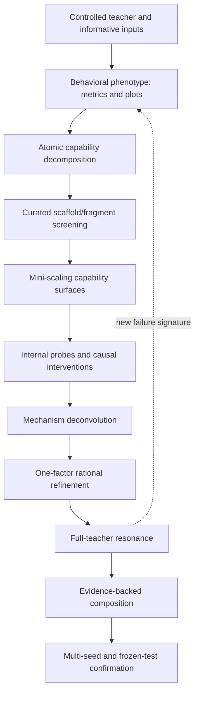

# Methodological corpus

This document restores the full intellectual framework behind the research program. The previous operating system correctly tracked experiments but represented only its administrative core. The canonical source identities and incorporated lessons are in [`methodology_source_index.json`](../research/methodology_source_index.json).

## The research object

We are doing nonlinear system identification of a controlled dynamical system. The present model begins as a black box—events in, 61 physical states out—but deliberately moves toward a grey box by adding progressively stronger, falsifiable assumptions. Biological knowledge is allowed to generate hypotheses; it cannot certify them.

The objective is not merely to approximate a dataset. It is to discover which information contract, functional primitives and compositions make the teacher dynamics *learnable* by gradient optimization, with good data efficiency and stable rollout.

## Three inseparable programs

1. **Scientific identification:** design informative inputs, characterize regimes, infer abstract properties and evaluate the forward model for its intended use.
2. **Architecture science:** decompose the target into atomic capabilities, screen established inductive biases, probe internal computation and distinguish expressivity from learnability.
3. **Constrained creative design:** generate diverse small sketches from a curated library, select hits, deconvolve their mechanisms, rationally refine them and only then compose them.

If any one is missing, the project degenerates: identification alone produces a benchmark; architecture science alone produces isolated facts; creativity alone produces arbitrary networks.

## Evidence stack

Each arrow has a different epistemic role. Output success proposes a hit; internal analysis explains whether the expected computation is present and used; ablation tests necessity; controlled comparison tests causal benefit; replication establishes robustness.

## What “physics” means here

The supplied *Physics of Language Models* material proposes a middle ground between two extremes:

- mathematical theory can be rigorous but rely on idealized assumptions and shallow analyzable models;
- benchmark “ethology” can study realistic systems but is noisy, confounded, contamination-prone and weak on mechanism;
- the physics middle works at a scale where data, training and architecture can be repeatedly controlled, while the learned behavior remains rich enough to reveal real mechanisms.

For Hay this means deliberately smaller models and synthetic microtasks are not inferior substitutes. They are measuring instruments. Their value depends on whether their conclusions later resonate in the actual four-compartment teacher.

## Core principles restored from the corpus

- **Existence is cheap; learnability is everything.** Representability does not imply SGD/Adam will discover or use the representation.
- **Behavior and internal computation differ.** A correct output does not prove the intended algorithm; a decodable latent does not prove the output path uses it.
- **Difficulty is an experimental variable.** Compare model size against controlled difficulty, not one capacity on one dataset.
- **Curves beat tables.** Learning curves, capability surfaces and transition boundaries reveal delayed emergence, noise and scaling behavior hidden by final scores.
- **Real mixed tasks conceal mechanisms.** Atomic synthetic tasks isolate memory, thresholds, propagation, switching and correction.
- **Vertical comparisons must be aligned.** Data, order, seeds, code, depth/width, parameter/update budgets and hyperparameter quality must be matched.
- **Creative invention is recombination under constraints.** Generate several structurally distinct sketches, then select and rationalize; do not wait for a single inspired architecture.
- **No single search philosophy is sufficient.** Rational, analogical, phenotypic, fragment-based and de-novo modes have different entry conditions and risks.
- **Negative results remain knowledge.** They close scoped claims without deleting the architecture family from the library.
- **Qualitative observations are scientific inputs.** Repeated waveform or activation morphology must be recorded and converted into measurable signatures, not dismissed because no scalar metric anticipated it.

## Canon-layer lesson without cargo culting

The relevant lesson is not “add a Conv1D.” It is the discovery procedure: isolate a capability, compare families, identify a shared missing information-flow primitive, insert the minimal established mechanism at controlled locations, validate it on the playground and finally test whether the synthetic insight appears at scale.

Our earlier causal frontend failed. That does not contradict the methodology: we inserted a particular local convolution based mainly on analogy, before demonstrating the exact capability deficit and insertion-point mechanism. The scoped failure is now an input to better deconvolution.

## Canonical companions

- [`creative_architecture_discovery.md`](creative_architecture_discovery.md): operational creative cycle.
- [`physics_of_models_translation.md`](physics_of_models_translation.md): direct translation of the supplied methodology to Hay.
- [`inductive_bias_taxonomy.md`](inductive_bias_taxonomy.md): complete search library by strength of assumption.
- [`evaluation_and_observation_protocol.md`](evaluation_and_observation_protocol.md): granular metrics, plots and internal statistics.
- [`research_operating_system.md`](research_operating_system.md): finite execution order and stop rules.

