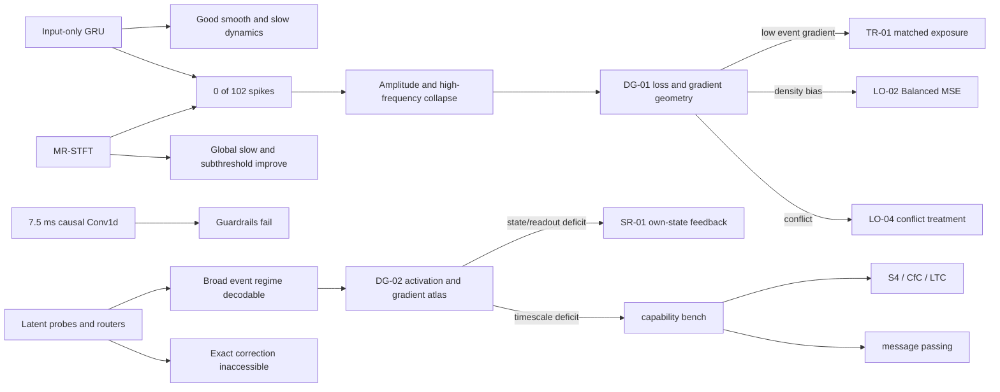

# Research operating system

This is the human entry point for the Hay micro-model architecture-discovery program. The plan is finite, evidence-gated and designed to prevent notebook accumulation without knowledge accumulation. Machine-readable sources of truth live in [`research/`](../research/README.md); the workbook is a generated navigation view.

## Objective

We want a data-efficient causal surrogate for the 61-state, four-compartment teacher and defensible claims about memory, fast/slow structure, state accessibility, spatial coupling, regime switching and partial modularity. Every experiment must distinguish at least two explanations. A score change that cannot update a hypothesis is not a research result.

## Current evidence and branching logic

## Finite master plan

Core ceiling: 36 notebooks. Conditional reserve: 12. Absolute ceiling: 48. A branch stops after two consecutive experiments reproduce the same falsifying signature without a new causal distinction. Scaling is forbidden until a bias passes a capacity-matched preflight.

| Phase | Purpose | Budget | State | Exit condition |
|---|---|---:|---|---|
| P0 Integrity | reproducibility and governance | 2 | complete | canonical files validate; test closed |
| P1 Observatory | output, representation and optimization diagnosis | 4 | active | failure mechanism ranked |
| P2 Capability bench | isolate algorithmic abilities | 4 | planned | unsuitable layers pruned |
| P3 Objective/exposure | imbalance, sampling, loss and rollout mismatch | 7 | planned | objective branch promoted or closed |
| P4 Scaffold screen | matched established causal operators | 10 | planned | one global scaffold promoted |
| P5 Composition | spatial, switching and multirate structure | 7 | planned | modular gain beats monolithic control |
| P6 Conditional axes | activation, normalization, optimizer, regularization | 8 conditional | gated | measured trigger resolved |
| P7 Synthesis | compose independently validated mechanisms | 4 | planned | ablated non-additive gain |
| P8 Confirmation | seeds, efficiency, rollout, OOD, one test opening | 4 | planned | bounded claim decided |

Detailed phase definitions are in [`master_plan.json`](../research/master_plan.json).

## Immediate order

1. Run **DG-01**, read-only, on the four frozen factorial-11 checkpoints.
2. Run **DG-02** on the identical validation batch manifest.
3. Select the next branch by signature: weak/noisy rare-event gradients -> TR-01; density bias -> LO-02; stable gradient opposition -> LO-04; inaccessible event phase -> SR-01; missing temporal capability -> CB-01 and then a matched scaffold screen.
4. Never select a branch because an architecture is fashionable.

The test stays closed through discovery. L0 diagnostics use no training; L1 is a one-seed preflight; L2 requires at least three seeds and uncertainty; L3 freezes the candidate and thresholds before one test evaluation.

Negative results are scoped. Factorial 11 rejects the tested 7.5 ms causal frontend under the input-only contract, not convolution in general. MR-STFT is insufficient for spikes at the tested weighting but improves the common/slow manifold.

## Canonical navigation

- [`knowledge_ledger.json`](../research/knowledge_ledger.json): claims and limitations.
- [`hypothesis_graph.json`](../research/hypothesis_graph.json): typed evidence links.
- [`experiment_registry.csv`](../research/experiment_registry.csv): status and decisions.
- [`architecture_catalog.json`](../research/architecture_catalog.json): established architecture funnel.
- [`indicator_catalog.json`](../research/indicator_catalog.json): diagnostic triggers and authorized actions.
- [`literature_evidence.csv`](../research/literature_evidence.csv): primary-source grounding.
- [`research_runbook.md`](research_runbook.md): mandatory procedure.

